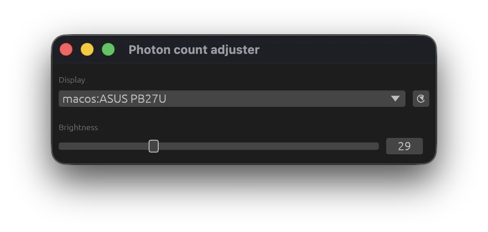

# Photon count adjuster

A small macOS and Windows application for changing external monitor brightness over DDC/CI.



## Requirements

- macOS or Windows
- A monitor with DDC/CI enabled
- [Rustup](https://rustup.rs/); the pinned nightly toolchain is installed automatically
- Visual Studio C++ Build Tools on Windows

Apple's built-in displays do not expose brightness through DDC/CI. On macOS, connect a compatible external display directly when possible; some docks and adapters do not pass DDC traffic through.

## Build and run

```shell
cargo run
```

Create an optimized executable with:

```shell
cargo build --release
```

Cargo is configured to ignore dependency releases younger than 14 days when resolving or updating `Cargo.lock`. This uses nightly Cargo's `min-publish-age` feature.

Install the current repository revision with:

```shell
cargo install --path . --locked
```
